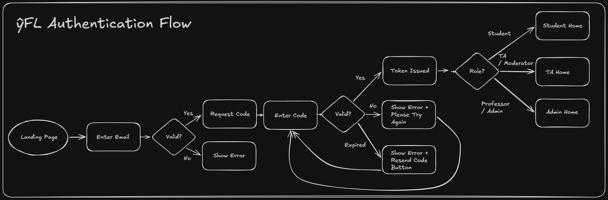
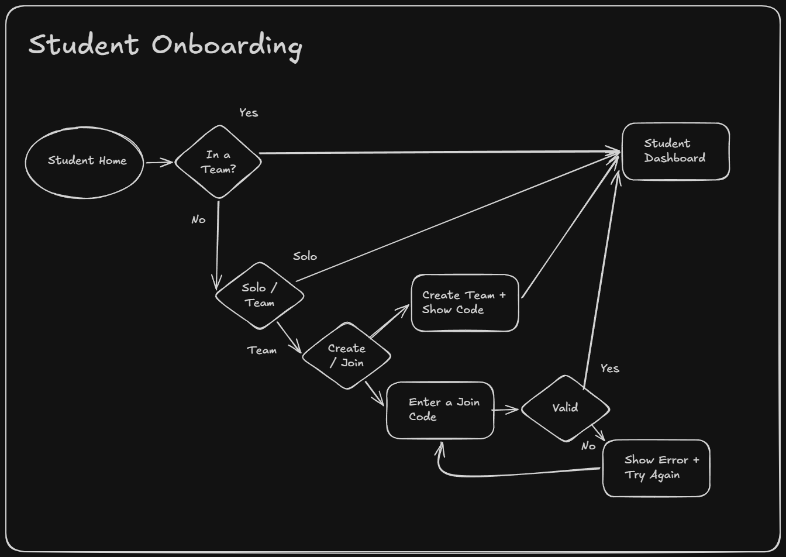

# ŷFL - Financial Forecasting League (System Design)

This is the second iteration of a project originally started at the University of California, Irvine. As part of a capstone course, our team worked with Professor Savlowitz to build a competitive financial forecasting platform. We shipped a working beta, but it remained incomplete when the group disbanded.

In hindsight, I believe that our biggest shortfall was systems design. We spent too little time documenting features and requirements, and design decisions made in team discussions were rarely recorded, which made the codebase harder to reason about and maintain as it grew.

This rewrite is an effort to correct that. I'm dedicating significantly more time to the design process before writing code. This document captures the design decisions I'm making and the reasoning behind them.

## The Problem
The motivation for transforming the original system into a full-stack web application is plentiful. First, creating an
instance of a season of forecasts is extremely time-consuming. You have to create a new excel sheet to hold unique data,
multiple queries to access specific data, and it's easy to manipulate the data from a cynical perspective.

## The Fix
Build a production-grade web platform to replace the original system which was a manual Excel/Alteryx/Google Drive 
workflow. A web platform reduces the time to create a season populated with students from an hour to a couple minutes.
We now have the ability to add role based access controls to a system which introduces a plethora of benefits. Data is 
persistent and can only be access by a specific role. The super admin view can see different seasons and user 
statistics on a single page. Teaching assistants or admins can be assigned to specific seasons to reduce the work of
the super admin.

## Stack

| Layer      | Technology                                     |
|------------|------------------------------------------------|
| Backend    | Java 21, Spring Boot 4.1.0                     |
| Database   | PostgreSQL 16 (Docker)                         |
| Migrations | Flyway                                         |
| Frontend   | Next.js (App Router), TypeScript, Tailwind CSS |
| Auth       | Passwordless OTP + JWT                         |

Java is a well-established choice for financial systems, with strong type safety and mature transaction handling. Spring Boot builds on this foundation and accelerates development with its annotation-driven approach to transactions, validation, and dependency injection.

The entire project is containerized with Docker for consistent, easy deployment. Flyway manages database schema migrations, keeping schema changes version-controlled and well-documented over time.

The previous version used Next.js for both frontend and backend. For this iteration, I chose a Spring Boot backend paired with a lightweight Vite/React frontend, a separation that better fits the strengths of each layer and keeps the codebase easier to reason about.

One feature the professor specifically liked was passwordless login: a generated code is emailed to the user, which redirects them to the home page upon verification.

## Design

A concept I learned through my internships and classes is to write everything out on pen and paper and save it. As a
team, we remembered certain design decisions differently, and we had no way to remember. 

## User Flows

Requirement drift was constantly appearing so I decided to make flow diagrams for each role. The goal of this is to
understand what each role can do and see what pages / views are necessary for the frontend. 

### Authentication and Authorization
As a group, we discussed multiple forms of authentications. The professor favored passwordless log in because users 
don't need to remember any passwords. Instead of account creation, the professor wanted to be able to upload lists
of user emails (like a list from Canvas) for each season. I want to respect that decision and create a flow around it. 
I designed a passwordless OTP auth flow that handles email validation, code expiry, and role-based redirects so 
students, TAs, and professors each land in the right place after login with ease.

> Uses a silent 200 response on unrecognized emails to prevent user enumeration.

### Student Onboarding

> Students join teams via an alphanumeric season-scoped code, similar to Jackbox.

### Student Game Loop

[//]: # (![Student Game Loop]&#40;student-game-loop-flow.png&#41;)

> Predictions are locked at question close time and cannot be edited after submission.

### Prediction Submission

[//]: # (![Prediction Submission]&#40;docs/flows/student-prediction-submission-flow.png&#41;)

> Supports binary (Yes/No) and continuous (numeric) question types with investment and confidence inputs.

---

## Architecture Notes

See `/docs/adr/` for Architecture Decision Records covering key decisions made during development.

---

## Project Status

| Phase | Description                        | Status      |
|-------|------------------------------------|-------------|
| 0     | Scaffolding and environment        | Done        |
| 1     | Auth and roles                     | In Progress |
| 2     | Seasons and teams                  | Not Started |
| 3     | Forecast questions and predictions | Not Started |
| 4     | Scoring and leaderboard            | Not Started |
| 5     | Hardening and performance          | Not Started |
| 6     | API docs and frontend integration  | Not Started |
| 7     | Polish and portfolio pass          | Not Started |

---

## Author

This is version 2. Version 1 was created as part of a University of California, Irvine masters capstone project where I worked with Professor Savlowitz.